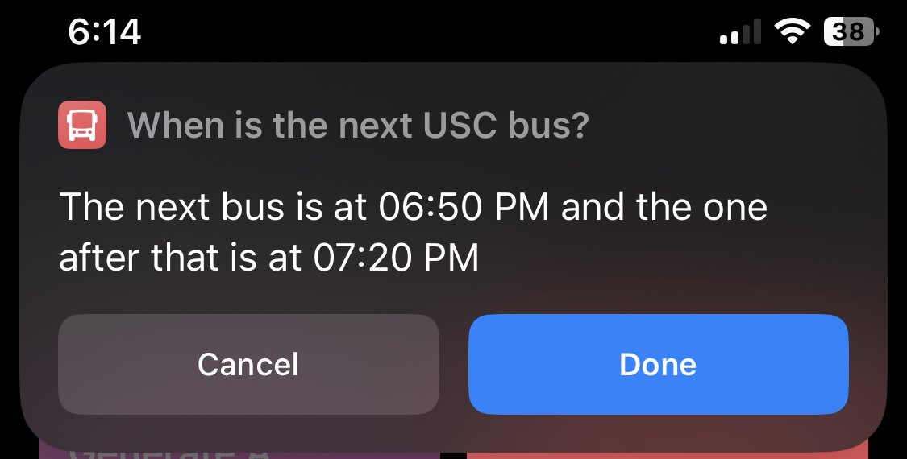

# USC_Bus_Times_API

## Description

This is the code for an API that provides the bus times for the University of Southern California. The API is written in Python and is meant to be hosted on AWS Lambda.

## iOS Shortcuts

### Links to Download Shortcuts

[When is the next USC bus?](https://www.icloud.com/shortcuts/0c7b2b5b5b5b5b5b5b5b5b5b5b5b5b5b)

[On this date when is the next USC bus?](https://www.icloud.com/shortcuts/0c7b2b5b5b5b5b5b5b5b5b5b5b5b5b5b)

### How to Use

If you want to use these shortcuts, all you have to do is download them from the links above. Then you can activate them either through the shortcuts app, the shortcuts widget or through Siri.

Both shortcuts will ask you for departure and destination bus stops. However the "On this date when is the next USC bus?" shortcut will also ask you to specify a time and date.

### Example Screenshot



## AWS Lambda API

### API URL

The API is hosted on AWS Lambda and can be accessed at the following URL:

```https://35eqpx2e2bekfro3dvy27cpjau0pncbu.lambda-url.us-west-2.on.aws/```

### How to Use the API

To use the API, all you have to do is send a GET request to the URL above with the parameters you want.

There are currently two main modes of the API specified by "requestType": getting locations and getting bus times. 

#### Getting Locations

All you have to do do get the locations is send a GET request to the URL above with the following parameters:

```requestType=returnLocations```

Example:

```https://35eqpx2e2bekfro3dvy27cpjau0pncbu.lambda-url.us-west-2.on.aws/?requestType=returnLocations```

#### Getting Bus Times

To get the bus times, you have to send a GET request to the URL above with the following parameters:

```requestType=returnTime```

```departure=HSC```

```destination=HSC```

Optionally, you can also specify a time and date:

```time=12:00```

```date=2023-02-01```

Example:

```https://35eqpx2e2bekfro3dvy27cpjau0pncbu.lambda-url.us-west-2.on.aws/?requestType=returnTime&departure=HSC&destination=HSC&time=12:00&date=2023-02-01```

The current implementation of getting bus times is very restrictive. It only returns a string with the results. If anyone mentions this in "Issues" I will add a full JSON response.

## Contributing to the List of Busses

Feel free to add to the list of busses in the ```bus-list.json``` file. [This is the website that I'm sourcing the times from.](https://transnet.usc.edu/index.php/bus-map-schedules/) The format is as follows:

```json
{
        "Departure":"Union Station",
        "Destination":"HSC",
        "weekdays": {
            "Times":["6:08","6:23",..."21:40"]
        },
        "weekends": {
            "Times":["8:45","10:10",..."16:10"]
        }
    }
```